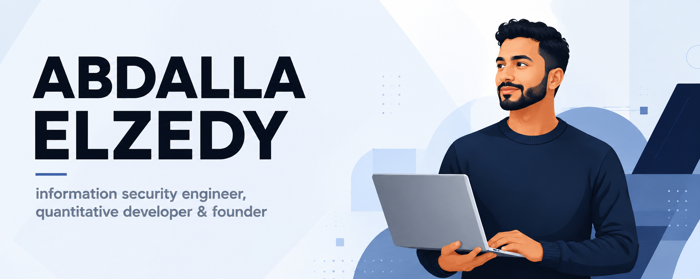

Information security engineer, nine years across financial services, higher education, and enterprise technology. The work spans detection engineering and threat hunting, incident response and investigation, penetration testing and vulnerability management, and identity and data governance in hybrid Azure and on-premises environments. I build the tooling that supports it, mostly in Python and PowerShell.

## Identity Intelligence Engine

Enterprise platform, 2024 to present. A hybrid identity data catalog that correlates Azure Entra ID, on-premises Active Directory, LDAP, and SQL records into a single model with source-of-record lineage, under a unified metadata schema and account classification taxonomy. Automated data quality logic surfaces duplicates, orphaned records, and stale identities. Microsoft Graph access runs through dedicated app registrations with least-privilege permissions and managed identities, so the pipeline stores no secrets. Python and Flask backend with connection pooling and concurrent multi-source ingestion, shipped through GitHub Actions with Trivy scanning.

## Neural Predictiva

<picture>
  <source media="(prefers-color-scheme: dark)" srcset="assets/neural-predictiva-logo-dark.png">
  
</picture>

Founder. A quantitative FX research system running a live multi-pair fleet on hourly data. Genetic algorithm strategy search with walk-forward out-of-sample evaluation, a broker execution simulator that models spread, slippage, swap, margin, and position limits, and a daily automated reoptimization pipeline. Backtest kernels are numba-compiled, and live monitoring runs through a PHP and MySQL dashboard. Strategy selection is governed by pre-registered experiments and deflated performance statistics.

## Repositories

- **[Cortex-XSIAM](https://github.com/AbdallaElzedy/Cortex-XSIAM)** XQL detection packs and threat hunting queries for Palo Alto Cortex XSIAM: account takeover chains, Microsoft 365 and Entra ID monitoring, NGFW traffic analysis, Windows event log investigation, and endpoint activity, plus XQL function and XDR data model references.
- **[AsmViz](https://github.com/AbdallaElzedy/AsmViz)** Browser-based x86-64 assembly visualizer built as a learning companion for Harvard CS61. Breaks down instructions, stack frame behavior, and control flow in AT&T syntax. Heuristic by design, not an emulator.
- **[WinRefresh](https://github.com/AbdallaElzedy/WinRefresh)** PowerShell tool that restores Windows 10 and 11 to a near-fresh state without reimaging: SFC and DISM repair, network stack reset, service and registry cleanup, restore point creation, and full logging.

## Focus areas

- **Detection and threat hunting:** ATT&CK-mapped detection engineering, SIEM content development, custom correlation and detection rules, time-series anomaly detection, analyst-facing dashboards
- **Incident response and investigation:** incident lifecycle management, first response, coordination across corporate security, IT, legal, and third parties
- **Offensive security:** penetration testing, network vulnerability assessment, enterprise vulnerability management programs
- **Cloud and identity:** hybrid identity architecture, least-privilege app registrations, managed identities, IAM
- **Governance:** NIST SP 800-53, FERPA, data classification, metadata schemas, lineage, data quality
- **Infrastructure:** zero trust network architecture, infrastructure as code, CI/CD across Windows and Linux

## Technologies I enjoy

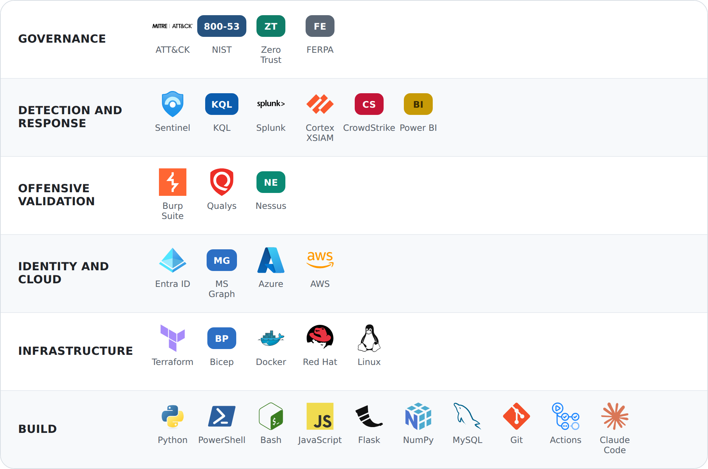

## Background

Started September 2016 as a SOC analyst at AlphaServe Technologies: penetration tests, network vulnerability assessments, and physical security reviews. Moved to security operations at Jefferies as first responder for incidents across financial services infrastructure, running the enterprise vulnerability management program and coordinating investigations across corporate security, IT, legal, and third parties. Then senior security engineering at Educational Testing Service, leading NIST SP 800-53 implementation across cloud and on-premises systems and building KQL detection analytics, Sentinel workbooks, and ML-assisted anomaly detection using linear regression on time-series telemetry. Currently completing an M.A. in Cybersecurity at Harvard University, expected 2027.

## Certifications

<table>
<tr>
<td align="center" width="112"> <b>SC-100</b> Cybersecurity Architect 2023</td>
<td align="center" width="112"> <b>AZ-500</b> Azure Security Engineer 2023</td>
<td align="center" width="112">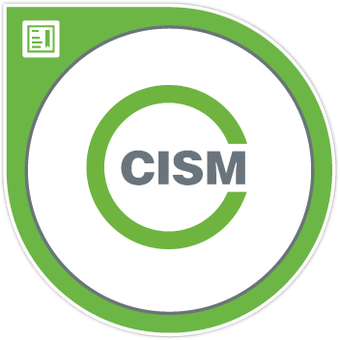 <b>CISM</b> ISACA 2023</td>
<td align="center" width="112">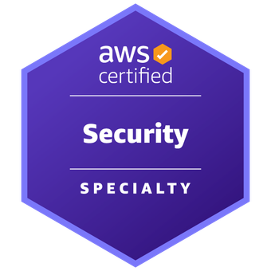 <b>AWS Security</b> Specialty 2020</td>
<td align="center" width="112">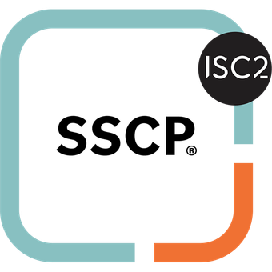 <b>SSCP</b> ISC2 2023</td>
<td align="center" width="112">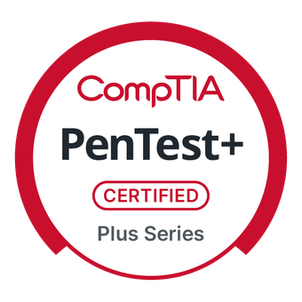 <b>PenTest+</b> CompTIA 2024</td>
</tr>
<tr>
<td align="center" width="112">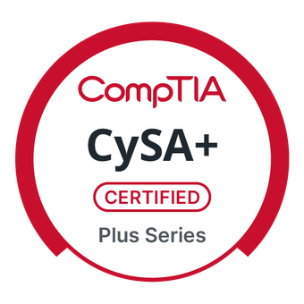 <b>CySA+</b> CompTIA 2023</td>
<td align="center" width="112">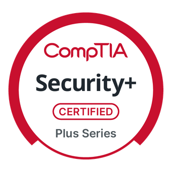 <b>Security+</b> CompTIA 2023</td>
<td align="center" width="112">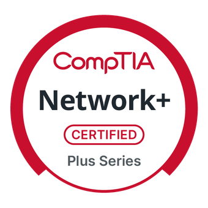 <b>Network+</b> CompTIA 2023</td>
<td align="center" width="112">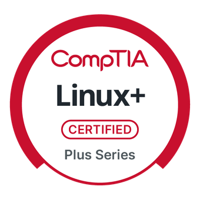 <b>Linux+</b> CompTIA 2016</td>
<td align="center" width="112">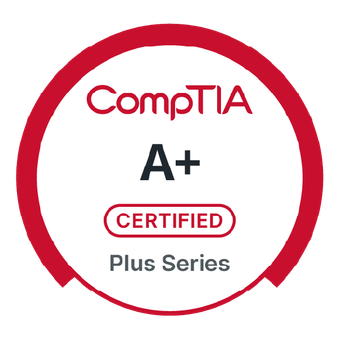 <b>A+</b> CompTIA 2023</td>
<td align="center" width="112"> <b>ITIL v4</b> Foundation 2020</td>
</tr>
</table>

---

